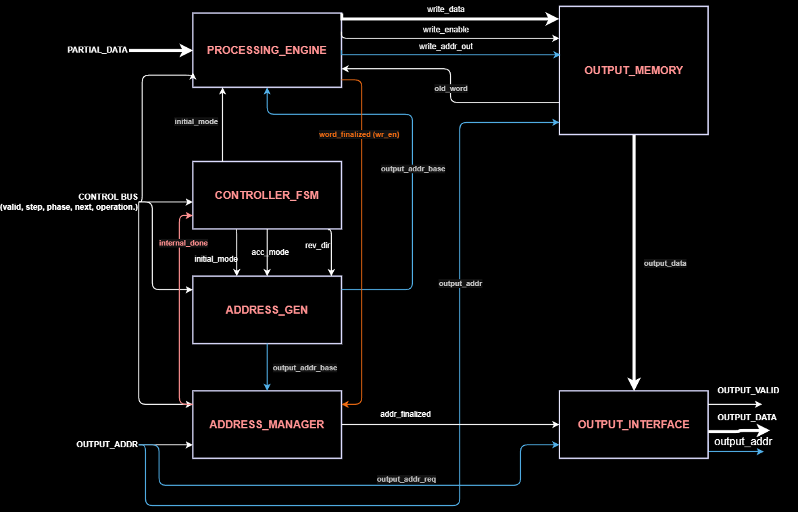

# Streamed Intermediate-Result Processing Module

RTL implementation for the IEEE ComSoc HelwanSC / IEEE Helwan Student Branch **RTL Design Challenge**.

## Overview

Modern compute pipelines split large tasks into stages, streaming intermediate ("partial") results out
of a compute engine over many cycles rather than producing a final answer in one shot. This module sits
between that compute engine and a downstream consumer:

- Accepts a continuous stream of **Partial Transactions** (`PARTIAL_SIZE` elements per transaction).
- Groups them into **logical processing segments** and **processing ranges**, per a control-signal
  hierarchy (`partial_valid` → `segment_step` → `phase_change` → `next_range` → `operation_done`).
- Runs two processing modes per range: `initial_partials` (first pass, forward) and
  `accumulated_partials` (subsequent passes, alternating forward/reverse across segments).
- Finalizes and exposes completed **Output Words** to a downstream interface via an
  address/valid/data lookup.

Full functional spec: [`docs/Digital_IC_Design_Hackathon.pdf`](docs/Digital_IC_Design_Hackathon.pdf).

## Architecture



| Module | Responsibility |
|---|---|
| `controller_fsm` | Top-level control FSM — tracks processing mode (initial/accumulate) and traversal direction. **(mine)** |
| `address_gen` | Generates the base output address for the current segment, tracking range offsets across ranges. **(mine)** |
| `address_manager` | Tracks the "finalized" watermark address and signals `internal_done` back to the FSM. |
| `processing_engine` | Concatenates/accumulates partial data into output words, drives memory writes. **⚠️ see note below** |
| `output_memory` | Storage array for output words; dual read port (downstream + accumulation feedback). |
| `output_interface` | Combinational lookup exposing `output_valid`/`output_data` for the requested `output_addr`. |

> **Open item:** `rtl/processing_engine_NEEDS_REVIEW.v` currently contains an `address_manager` module
> (a second, slightly different version of `rtl/address_manager.v`), not `processing_engine`. The actual
> `processing_engine` module hasn't been uploaded yet. Needs to be resolved before this repo is
> considered complete — see [`docs/diagrams/architecture.png`](docs/diagrams/architecture.png) for what
> that block needs to do.

## Repo layout

```
rtl/                          RTL source (Verilog)
docs/
  Digital_IC_Design_Hackathon.pdf   Full spec
  diagrams/                         Architecture + FSM diagrams
  my-part/                          Detailed writeup of controller_fsm + address_gen
```

## My contribution

I designed and implemented the **`controller_fsm`** and **`address_gen`** modules — see
[`docs/my-part/controller_fsm_and_address_gen.md`](docs/my-part/controller_fsm_and_address_gen.md)
for a full writeup of the state machine, the segment-traversal algorithm, and how address generation
tracks range offsets across the buffer.

## Configuration parameters

| Parameter | Default | Description |
|---|---|---|
| `DATA_WIDTH` | 16 | Bits per data element |
| `PARTIAL_SIZE` | 4 | Elements per Partial Transaction |
| `OUTPUT_SIZE` | 8 | Elements per Output Word |
| `ADDR_WIDTH` | 8 | Width of output addresses |
| `MAX_SEGMENTS_PER_RANGE` | 100 | Max segments per processing range |
