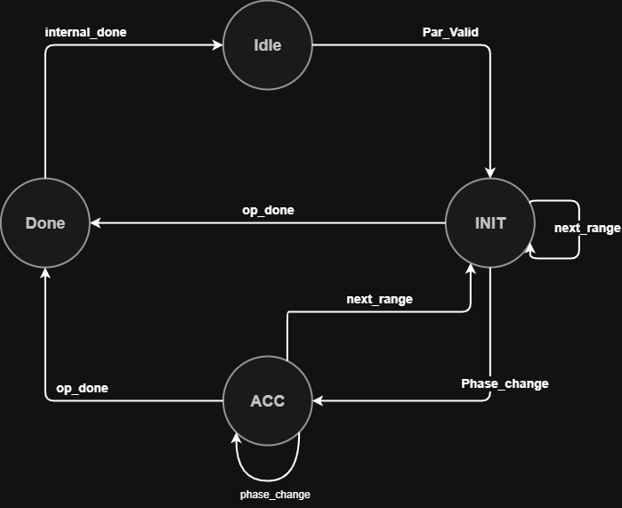

# My Part: `controller_fsm` + `address_gen`

These two modules together decide *which processing mode/direction* the datapath is in, and *where*
each segment's output words should be written. Everything else in the design (accumulation math,
memory, output lookup) reacts to the signals these two modules produce.

## `controller_fsm`

### States



| State | Meaning |
|---|---|
| `IDLE` | Reset / between operations. Waiting for the first Partial Transaction. |
| `INITIAL` | `initial_partials` mode — segments within the current range are being filled for the first time, forward only. |
| `ACCUMULATE` | `accumulated_partials` mode — segments are being revisited and accumulated, direction alternates on each `phase_change`. |
| `COMPLETE` | `operation_done` accepted; waiting on the datapath (`internal_done` from `address_manager`) to finish flushing remaining output words before returning to `IDLE`. |

### Transitions

- `IDLE → INITIAL` on the first `partial_valid`.
- `INITIAL → ACCUMULATE` on `phase_change` (first phase boundary of the range — switches mode, not just direction).
- `INITIAL/ACCUMULATE → INITIAL` on `next_range` (every new range always restarts in `initial_partials`, per spec §5.3.5).
- `INITIAL/ACCUMULATE → COMPLETE` on `operation_done`.
- `COMPLETE → IDLE` once `internal_done` is asserted by `address_manager`, confirming all finalized output words have been produced.

This directly follows the spec's control-signal hierarchy (§5.3): `operation_done` implies `next_range`
implies `phase_change` implies `segment_step` implies `partial_valid`, so the higher-priority checks are
evaluated first in the `case` block.

### `reverse_direction`

Tracks traversal direction for `address_gen`:
- Cleared in `IDLE`.
- Set to reverse (`1`) on the **first** `phase_change` (the `INITIAL → ACCUMULATE` transition) — per spec
  §5.3.4/§6.2, accumulation always begins from the *last* segment of the range.
- Toggled on every **subsequent** `phase_change` while already in `ACCUMULATE` (alternating forward/reverse, §6.4).
- Forced back to forward (`0`) on `next_range`, since every new range restarts forward in `initial_partials`.

## `address_gen`

Computes `output_addr_base` — the address of the first output word belonging to the current segment —
and tracks `current_segment` within the active range.

### Segment counter (`current_segment`)

- **`initial_mode`**: increments forward, one segment per `segment_step`, capped at `MAX_SEGMENTS-1`.
- **`accumulate_mode`**: increments or decrements depending on `reverse_direction`, so it walks back
  toward segment 0 on the first accumulation pass and back up on the next.
- On `phase_change` (segment_step also asserted per spec §5.3.1, since phase_change implies segment_step):
  the counter holds — the same last segment of `initial_mode` is revisited first in `accumulate_mode`,
  matching spec §6.2 ("processing resumes from the last logical processing segment").
- On `next_range`: resets to segment 0, and `range_offset` advances by the number of output words the
  *just-completed* range actually produced.

### Range offset (`range_offset`)

Each processing range can use a variable number of segments (up to `MAX_SEGMENTS_PER_RANGE`), so ranges
don't produce a fixed number of output words. `range_offset` is the running base address for the range
currently being processed:

```
range_offset_next = range_offset + (effective_max_segment_reached + 1) × OUTPUTS_PER_SEGMENT
```

`effective_max` (via the `max_segment` tracker) records the highest segment index actually visited
during the range (the point reached at the end of the forward `initial_partials` pass), so the offset
advances by the true number of output words produced by that range — not a fixed guess — before the
next range starts writing.

### Output

```verilog
output_addr_base = range_offset + (current_segment << $clog2(OUTPUTS_PER_SEGMENT))
```

This is the base address for the current segment; `processing_engine` adds the per-word offset within
the segment (0 or 1 for the default `OUTPUTS_PER_SEGMENT = 2`) when it writes each finalized word.

## Known limitations / open questions

- `address_gen`'s `MAX_SEGMENTS` parameter and `LAST_SEGMENT` saturation logic haven't been stress-tested
  against the full `MAX_SEGMENTS_PER_RANGE = 100` boundary case.

